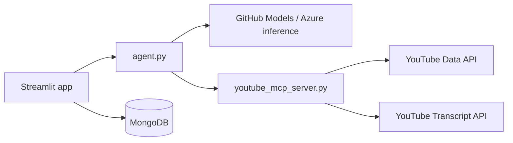

# YouTube AI Research Agent

An AI agent that researches topics on YouTube: it searches for recent videos, reads transcripts, and returns a structured research report. A Streamlit UI saves each report to MongoDB and lets you revisit past searches.

## How it works



1. **MCP server** (`youtube_mcp_server.py`) exposes tools to search YouTube and fetch video transcripts.
2. **Agent** (`agent.py`) connects to the MCP server over stdio, calls tools via an OpenAI-compatible chat loop, then formats the result as a Pydantic `YouTubeResearchReport`.
3. **Streamlit app** (`app.py`) runs the agent from the browser, displays the report, and stores history in MongoDB.

## Prerequisites

- Python 3.12+
- [uv](https://docs.astral.sh/uv/) (recommended) or another way to install dependencies from `pyproject.toml`
- [MongoDB](https://www.mongodb.com/) (local or Atlas) for search history in the UI
- API keys:
  - **GitHub Models** — [create a token](https://github.com/settings/tokens) and use it as `OPENAI_API_KEY` (inference runs at `https://models.inference.ai.azure.com`)
  - **YouTube Data API v3** — enable the API in [Google Cloud Console](https://console.cloud.google.com/) and create an API key

## Setup

```bash
git clone <your-repo-url>
cd youtube_openai

uv sync
```

Create a `.env` file in the project root (see `.gitignore` — do not commit it):

```env
OPENAI_API_KEY=your_github_models_token
YOUTUBE_API_KEY=your_youtube_data_api_key
MONGO_URI=mongodb://localhost:27017/
```

Optional: set LangSmith env vars if you use tracing via `wrap_openai` in `config.py`.

## Usage

### Web UI (recommended)

```bash
uv run streamlit run app.py
```

Enter a research question, click **Generate Research Report**, and view topic, summary, takeaways, and source URLs. Recent searches appear in the sidebar.

### CLI

Run the agent directly without the UI:

```bash
uv run python agent.py
```

Edit the query in the `if __name__ == "__main__"` block in `agent.py`, or import `run_youtube_agent` from your own script.

### MCP server alone

The agent starts the MCP server automatically. To run it standalone for debugging:

```bash
uv run python youtube_mcp_server.py
```

## Project layout

| File | Role |
|------|------|
| `app.py` | Streamlit UI and MongoDB persistence |
| `agent.py` | MCP client, tool-calling loop, structured report output |
| `youtube_mcp_server.py` | MCP tools: `search_youtube`, `get_video_transcript` |
| `config.py` | GitHub Models client and LangSmith wrapping |
| `pyproject.toml` | Dependencies and Python version |

## Output schema

Reports use the `YouTubeResearchReport` model:

- `topic` — main subject
- `summary` — narrative from transcript analysis
- `key_takeaways` — bullet list of important points
- `source_urls` — YouTube URLs used in the research

## Notes

- The agent is instructed to search YouTube, fetch a transcript, and only then produce a final answer.
- Transcripts are truncated to 5000 characters in the MCP tool to limit token usage.
- Default LLM in the agent loop is `gpt-4o` via GitHub Models; `config.py` also defines `gpt-4.1-nano` for the agents SDK wrapper.
