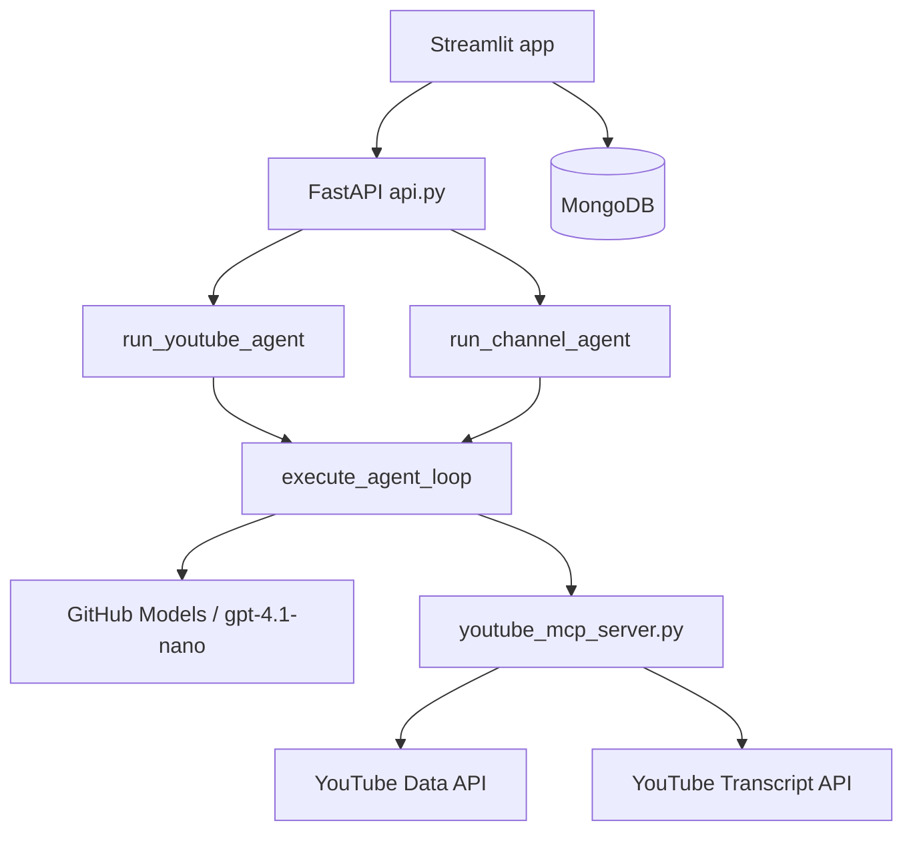

# YouTube AI Research Agent

AI agents that research YouTube in two modes: **single-video research** (search, transcripts, stats, comment sentiment) and **channel deep dives** (latest videos, multi-transcript narrative analysis). A Streamlit UI calls a FastAPI backend that runs the agents, saves typed reports to MongoDB, and lets you revisit past searches.

## How it works



1. **MCP server** (`youtube_mcp_server.py`) exposes YouTube search, transcript, stats, comments, and channel video tools over stdio.
2. **Agent** (`agent.py`) uses a shared `execute_agent_loop` for tool calling and structured Pydantic output, with separate prompts and schemas per mode.
3. **FastAPI** (`api.py`) exposes HTTP endpoints so the UI can run agents without blocking the Streamlit process.
4. **Streamlit app** (`app.py`) provides two tabs, persists `video_report` and `channel_report` documents, and auto-loads the most recent search on startup.

## Modes

### Single video research

`run_youtube_agent(query)` → `YouTubeResearchReport`

Workflow:

1. `search_youtube` — find a relevant, recent video
2. `get_video_details` — likes, comments, channel subscriber count
3. `get_video_transcript` — read the video content
4. `get_video_comments` — top comments for sentiment
5. Compile report (only after transcript and details are fetched)

UI: embedded player, engagement metrics, likes vs. comments chart, sentiment, summary, takeaways, sources.

### Channel deep dive

`run_channel_agent(channel_query)` → `ChannelDeepDiveReport`

Workflow:

1. `get_channel_latest_videos` — resolve channel by name/handle, fetch 3 latest video IDs
2. `get_video_transcript` — read each of the 3 transcripts
3. Synthesize overarching narrative, recent topics, and target audience

UI: channel name, overarching theme, recent topics, target audience.

## Prerequisites

- Python 3.12+
- [uv](https://docs.astral.sh/uv/) (recommended) or another way to install dependencies from `pyproject.toml`
- [MongoDB](https://www.mongodb.com/) (local, Atlas, or reachable from Docker via `host.docker.internal`) for search history
- API keys:
  - **GitHub Models** — [create a token](https://github.com/settings/tokens) and set `OPENAI_API_KEY` (inference at `https://models.inference.ai.azure.com`)
  - **YouTube Data API v3** — enable in [Google Cloud Console](https://console.cloud.google.com/) (search, videos, channels, comment threads)

## Setup

```bash
git clone <your-repo-url>
cd youtube_openai

uv sync
```

Create a `.env` file in the project root (see `.gitignore` — do not commit it):

```env
OPENAI_API_KEY=your_github_models_token
YOUTUBE_API_KEY=your_youtube_data_api_key
MONGO_URI=mongodb://localhost:27017/
```

Optional LangSmith tracing (used by `wrap_openai` in `config.py`):

```env
LANGCHAIN_TRACING_V2=true
LANGCHAIN_ENDPOINT=https://api.smith.langchain.com
LANGCHAIN_API_KEY=your_langsmith_key
LANGCHAIN_PROJECT=Youtube_Project
```

## Usage

### Docker Compose (recommended)

Runs the FastAPI backend and Streamlit frontend as separate services. The UI talks to the API at `http://backend:8000` (Docker service name).

```bash
docker compose up --build
```

| Service | URL |
|---------|-----|
| Streamlit UI | http://localhost:8501 |
| FastAPI API | http://localhost:8000 |
| API docs | http://localhost:8000/docs |

MongoDB is not included in `docker-compose.yml`. Point `MONGO_URI` in `.env` to Atlas, or to a host MongoDB instance (on macOS/Windows Docker Desktop, use `mongodb://host.docker.internal:27017/`).

### Local development

Run the API and UI in two terminals. **Note:** `app.py` is configured for Docker and calls `http://backend:8000`. For local runs without Docker, change those URLs to `http://localhost:8000` or add a `BACKEND_URL` env var.

**Terminal 1 — API:**

```bash
uv run uvicorn api:app --reload --port 8000
```

**Terminal 2 — UI:**

```bash
uv run streamlit run app.py
```

Two tabs in the UI:

| Tab | Action | Output |
|-----|--------|--------|
| **Single Video Research** | Enter a topic → **Generate Video Report** | `YouTubeResearchReport` |
| **Channel Deep Dive** | Enter channel name or handle (e.g. `@mkbhd`) → **Analyze Channel** | `ChannelDeepDiveReport` |

The sidebar lists the 15 most recent searches (🎥 video, 📺 channel). Click any entry to reload that report.

### HTTP API

| Method | Path | Body | Response |
|--------|------|------|----------|
| `POST` | `/api/research/video` | `{"query": "..."}` | `YouTubeResearchReport` |
| `POST` | `/api/research/channel` | `{"query": "..."}` | `ChannelDeepDiveReport` |

Example:

```bash
curl -X POST http://localhost:8000/api/research/video \
  -H "Content-Type: application/json" \
  -d '{"query": "Find a recent video about quantum computing and summarize it."}'
```

### CLI

```bash
uv run python agent.py
```

Imports:

```python
from agent import run_youtube_agent, run_channel_agent
```

Edit the example in the `if __name__ == "__main__"` block, or call either function from your own script.

### MCP server alone

The agent spawns the MCP server via `sys.executable`. To debug it standalone:

```bash
uv run python youtube_mcp_server.py
```

## MCP tools

| Tool | Description |
|------|-------------|
| `search_youtube` | Search videos by query (ordered by date) |
| `get_video_transcript` | Captions for a `video_id` (truncated to 5000 chars) |
| `get_video_details` | Likes, comment count, channel subscriber count |
| `get_video_comments` | Top relevant comments for sentiment analysis |
| `get_channel_latest_videos` | Find channel by name/handle, return 3 latest video IDs |

## Project layout

| File | Role |
|------|------|
| `app.py` | Streamlit UI (two tabs), MongoDB persistence, report rendering |
| `api.py` | FastAPI routes for video and channel research |
| `agent.py` | `execute_agent_loop`, video and channel agents, Pydantic schemas |
| `youtube_mcp_server.py` | FastMCP server and YouTube API tools |
| `config.py` | GitHub Models `AsyncOpenAI` client (LangSmith-wrapped) |
| `Dockerfile` | Python 3.12 image with `uv sync` |
| `docker-compose.yml` | Backend (uvicorn) + frontend (streamlit) services |
| `pyproject.toml` | Dependencies and Python version |

## Output schemas

### `YouTubeResearchReport` (video mode)

| Field | Description |
|-------|-------------|
| `topic` | Main subject |
| `summary` | Narrative from transcript and comment analysis |
| `key_takeaways` | Bullet list of important points |
| `source_urls` | YouTube URLs used |
| `channel_subscribers` | Subscriber count |
| `like_count` | Like count |
| `comment_count` | Comment count |
| `audience_sentiment` | Short summary of comment tone |

### `ChannelDeepDiveReport` (channel mode)

| Field | Description |
|-------|-------------|
| `channel_name` | Official channel name |
| `overarching_theme` | Summary of current focus, narrative, or bias |
| `recent_topics` | Topics from analyzed videos |
| `target_audience` | Who the channel appears to target |

## Notes

- Default model: `gpt-4.1-nano` via GitHub Models (`agent.py`).
- MCP server is launched with `sys.executable` so it uses the same Python environment as the agent.
- Transcripts are truncated to 5000 characters to limit token usage.
- Comment fetching may fail if comments are disabled; video analysis can still proceed from transcripts.
- MongoDB: database `youtube_agent_db`, collection `searches`. Documents include `type` (`video_report` | `channel_report`), `user_query`, `report_data`, and `timestamp`.
