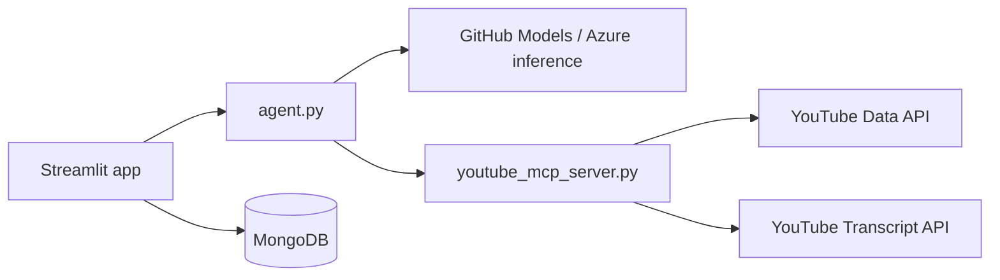

# YouTube AI Research Agent

An AI agent that researches topics on YouTube: it searches for recent videos, reads transcripts, pulls engagement stats, analyzes top comments for audience sentiment, and returns a structured research report. A Streamlit UI embeds the primary video, charts likes vs. comments, saves reports to MongoDB, and lets you revisit past searches.

## How it works



1. **MCP server** (`youtube_mcp_server.py`) exposes tools to search YouTube, fetch transcripts, read video/channel statistics, and load top comments.
2. **Agent** (`agent.py`) connects to the MCP server over stdio, runs a tool-calling loop with GitHub Models (`gpt-4o`), then formats findings into a Pydantic `YouTubeResearchReport`.
3. **Streamlit app** (`app.py`) runs the agent from the browser, renders sentiment, metrics, an embedded player, and an engagement chart, and persists history in MongoDB.

### Agent workflow

The system prompt instructs the model to:

1. `search_youtube` — find a relevant, recent video
2. `get_video_details` — likes, comment count, channel subscriber count
3. `get_video_transcript` — read the video content
4. `get_video_comments` — sample top comments for sentiment
5. Compile a structured report (only after transcript and details are fetched)

## Prerequisites

- Python 3.12+
- [uv](https://docs.astral.sh/uv/) (recommended) or another way to install dependencies from `pyproject.toml`
- [MongoDB](https://www.mongodb.com/) (local or Atlas) for search history in the UI
- API keys:
  - **GitHub Models** — [create a token](https://github.com/settings/tokens) and set `OPENAI_API_KEY` (inference at `https://models.inference.ai.azure.com`)
  - **YouTube Data API v3** — enable the API in [Google Cloud Console](https://console.cloud.google.com/) and create an API key (search, videos, channels, and comment threads endpoints)

## Setup

```bash
git clone <your-repo-url>
cd youtube_openai

uv sync
```

Create a `.env` file in the project root (see `.gitignore` — do not commit it):

```env
OPENAI_API_KEY=your_github_models_token
YOUTUBE_API_KEY=your_youtube_data_api_key
MONGO_URI=mongodb://localhost:27017/
```

Optional: set LangSmith env vars if you use tracing via `wrap_openai` in `config.py`.

## Usage

### Web UI (recommended)

```bash
uv run streamlit run app.py
```

Enter a research question and click **Generate Research Report**. The UI shows:

- Audience sentiment (color-coded)
- Summary and key takeaways
- Source URLs
- Embedded YouTube player for the primary source
- Metrics: channel subscribers, likes, comments
- Bar chart of likes vs. comments

Recent searches appear in the sidebar; click one to reload its report.

### CLI

```bash
uv run python agent.py
```

Edit the query in the `if __name__ == "__main__"` block in `agent.py`, or import `run_youtube_agent` from your own script.

### MCP server alone

The agent starts the MCP server automatically. To run it standalone for debugging:

```bash
uv run python youtube_mcp_server.py
```

## MCP tools

| Tool | Description |
|------|-------------|
| `search_youtube` | Search videos by query (ordered by date) |
| `get_video_transcript` | Fetch captions for a `video_id` (truncated to 5000 chars) |
| `get_video_details` | Likes, comment count, and channel subscriber count |
| `get_video_comments` | Top relevant comments for sentiment analysis |

## Project layout

| File | Role |
|------|------|
| `app.py` | Streamlit UI, MongoDB persistence, video embed, engagement chart |
| `agent.py` | MCP client, tool-calling loop, structured report output |
| `youtube_mcp_server.py` | FastMCP server and YouTube API tools |
| `config.py` | GitHub Models client and LangSmith wrapping |
| `pyproject.toml` | Dependencies and Python version |

## Output schema

Reports use the `YouTubeResearchReport` Pydantic model:

| Field | Description |
|-------|-------------|
| `topic` | Main subject |
| `summary` | Narrative from transcript and comment analysis |
| `key_takeaways` | Bullet list of important points |
| `source_urls` | YouTube URLs used in the research |
| `channel_subscribers` | Formatted subscriber count (e.g. `1.2M`) |
| `like_count` | Formatted like count |
| `comment_count` | Formatted comment count |
| `audience_sentiment` | Short summary of comment/reaction tone |

## Notes

- Transcripts are truncated to 5000 characters in the MCP tool to limit token usage.
- Comment fetching may fail if comments are disabled on a video; the agent should still proceed with transcript-based analysis.
- Default LLM in the agent loop is `gpt-4o` via GitHub Models; `config.py` also defines `gpt-4.1-nano` for the agents SDK wrapper.
- MongoDB database: `youtube_agent_db`, collection: `searches`.
